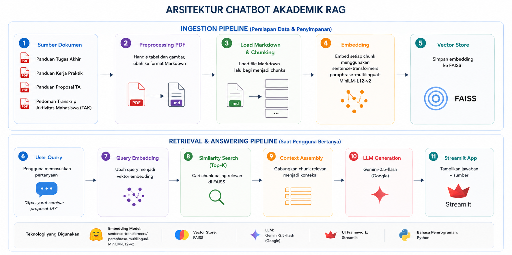

# Academic Chatbot RAG — Faculty of Informatics, Telkom University

A **Retrieval-Augmented Generation (RAG)** chatbot that answers questions about academic procedures at the Faculty of Informatics, Telkom University. Built as a capstone project.

**Live Demo:** [chatbot-fakultas-informatika-telkom-university-2w5vbgbw4ghqhkj.streamlit.app](https://chatbot-fakultas-informatika-telkom-university-2w5vbgbw4ghqhkj.streamlit.app/)



**Built by:**
- Kevin Jonathan Rotty — Team Lead [@KevinJonathanR](https://github.com/KevinJonathanR)
- Justin Jeremia [@jeremiajstin](https://github.com/jeremiajstin)
- Julian Sudiyanto [@JulianSudiyanto](https://github.com/JulianSudiyanto)
- Keisha Hernantya Zahra [@keishahz](https://github.com/keishahz)

---

## Features

- Answers questions grounded in official academic documents (KP, TA, Proposal TA, TAK)
- Responses are sourced directly from documents — not from the model's general knowledge
- Clean web interface built with Streamlit

---

## How It Works

The chatbot follows a standard RAG pipeline:

1. **Ingestion** — PDFs are cleaned and converted to Markdown, then split into smaller chunks
2. **Embedding** — Each chunk is encoded into a vector using a multilingual sentence transformer
3. **Vector Storage** — Embeddings are indexed and stored in a FAISS vector database
4. **Retrieval** — When a user asks a question, the top-k most similar chunks are retrieved
5. **Generation** — Retrieved chunks are passed as context to Gemini, which generates a grounded answer

```
User Query → Embedding → FAISS Retrieval → Context + Query → Gemini LLM → Answer
```

---

## Source Documents

| Document | Content |
|---|---|
| Panduan KP | Procedures and requirements for Kerja Praktik (internship) |
| Panduan TA FIF | Guidelines for Tugas Akhir (final project) |
| Pedoman Proposal TA | Format and requirements for TA proposals |
| Pedoman TAK | Guidelines for Tugas Akhir Komprehensif |

---

## Tech Stack

| Component | Technology |
|---|---|
| Embedding | `sentence-transformers` (paraphrase-multilingual-MiniLM-L12-v2) |
| Vector Database | FAISS |
| LLM | Google Gemini API (`gemini-2.5-flash`) |
| Orchestration | LangChain |
| UI | Streamlit |
| Deployment | Streamlit Community Cloud |

---

## Project Structure

```
chatbot-project/
├── raw_file/               # Source PDF documents
├── cleaned_file/           # Cleaned Markdown versions of the PDFs
├── data/
│   └── faiss_db/          # Vector database (generated by ingest.py)
├── src/
│   ├── chunking.py         # Splits documents into chunks
│   ├── embedding.py        # Creates embeddings and stores to FAISS
│   ├── retriever.py        # Retrieves relevant chunks for a given query
│   ├── llm.py              # Connects to the Gemini API
│   └── rag_chain.py        # Full RAG pipeline
├── assets/                 # Images and other assets
├── app.py                  # Streamlit application entry point
├── ingest.py               # Document processing script (run once)
├── requirements.txt
└── .env.example
```

---

## Local Setup

### Prerequisites
- Python 3.10+
- Google account (for a free Gemini API key)

### Installation

**1. Clone the repository**
```bash
git clone https://github.com/KevinJonathanR/chatbot-fakultas-informatika-telkom-university.git
cd chatbot-fakultas-informatika-telkom-university
```

**2. Create a virtual environment**
```bash
python -m venv venv
source venv/bin/activate        # Mac/Linux
venv\Scripts\activate           # Windows
```

**3. Install dependencies**
```bash
pip install -r requirements.txt
```

**4. Configure API key**
```bash
cp .env.example .env
```
Open `.env` and set `GEMINI_API_KEY` with your key from [Google AI Studio](https://aistudio.google.com/).

**5. Process documents into the vector database**
```bash
python ingest.py
```
> Only needs to run once. Re-run only if documents in `cleaned_file/` change.

**6. Start the application**
```bash
streamlit run app.py
```

Open your browser at `http://localhost:8501`

---

## Deployment

To deploy to **Streamlit Community Cloud** for free:

1. Push the repository to GitHub
2. Go to [share.streamlit.io](https://share.streamlit.io) and connect your repo
3. Add `GEMINI_API_KEY` under **Secrets** in the dashboard
4. Make sure `data/faiss_db/` is committed to the repository

---

## License

Built as a Capstone Project — Faculty of Informatics, Telkom University.
